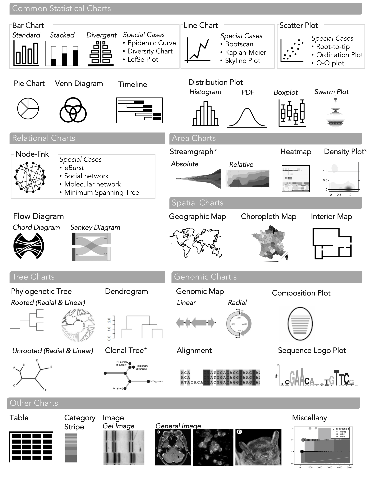
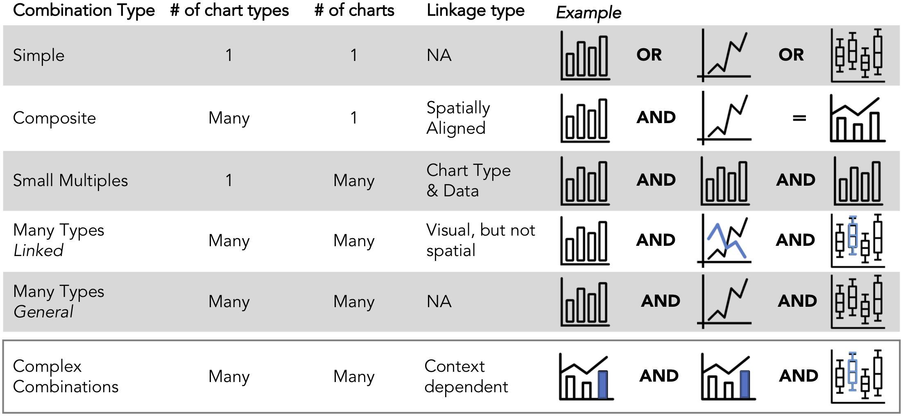

# Welcome to the GEViT Gallery
* [Overview](#overview)
* [Exploring the design space](#galExplore)
    * [Gallery Structure](#galStructure)
        * [Filtering Visualizations](#filterVis)
    * [Visualization Context](#visContext)
    * [Visualization Design](#visDesign)
* [Cite](#citation)

<h2 id="overview">Overview</h2>

This gallery has been implemented to distribute the research findings presented in Crisan *et. al.* (2018) ['A method for systematically surveying data visualizations in infectious disease genomic epidemiology'](https://www.biorxiv.org/content/early/2018/05/22/325290). The goal of this research was construct a visualization design space that characterized common data visualization practices within infectious disease genomic epidemiology. Please consult the manuscript for more details on the research behind GEViT. 

***Disclaimer:***
The images in the GEViT gallery are presented solely for research purposes and under copyright Fair Use terms. Clicking on an image provides a link back to the original source publication. Beyond the images themselves no other materials relating to the published articles (such as PDFs of the full text) have been made available. If you are an author of a publication contained with this gallery and you would like your work to be removed please [notify us](https://github.com/amcrisan/gevit_gallery_v2/issues).

<h2 id="galExplore">Exploring the design space</h2>

The GEViT Gallery is structured around exploring the visualization design space on two axes: visualization context and visualization design. More details about these two axes are available in our publication, but they are briefly listed here as well to help you explore the GEViT gallery.

<h3 id="galStructure" style="margin-left: 0;">The GEViT Gallery Structure</h3>

**Catalogue :** 
The catalogue contains figures and some missed opportunity tables that can be browsed or filtered by visualization context and design details. The library catalogue was current to August 2017. We are in working on ways to automatically expand the GEViT gallery, so stay tuned for future updates!

**Individual Figures :**
When an figure is clicked on your will be automatically re-directed to the Figure tab, which will provide additional details about the visualization design. You will also be able to link back to the original source publication.

**Sidebar Menu :** 
The sidebar menu primarily supports filtering functions for the gallery, which are listed below. In all filtering options it is possible to *click in the search box* and *start typing* in order to review the options. 

<h4 id="filterVis" style="margin-left: 0;">Filtering visualizations</h4>
You can casually browse the gallery catalogue or filter data visualizations to target different contexts (for example a hospital outbreak with specific pathogens). You can filter by visualization context, or you can filter by any of the chart types and chart combinations and you have the option of limiting your search to chart types that have some form of enhancement. 

<h3 id="visContext" style="margin-left: 0;">Visualization Context</h3>
Visualization context is derived from pathogen information derived from article titles and abstracts, the application of a priori concepts, and the existence of text in the figure captions. More details are shown in the GEViT manuscript. There are a total of 32 pathogens, 23 a priori concepts, and hundreds of terms within the figure captions. Within the sidebar menu, you can **click on the text box and start typing** to explore different options. 

<h3 id="visDesign" style="margin-left: 0;">Visualization Design</h3>
Visualization designs detail how a data visualization was constructed and are represented by chart types, chart combinations, and chart enhancements.

*Chart types* as the basic building block of data visualizations. Our analysis of the infectious disease genomic epidemiology literature revealed ## of unique chart types that we further characterized into seven categories. The chart types that are browsable in the GEViT Gallery are:

*Chart enhancements* are changes to the base chart types to encode additional information. We differentiated between instances of add new marks to the chart type and also the re-encoding existing marks in order to encode additional information. In the figure below we **a)** summarize the types of chart enhancements documented in our research and show an example of enhancements to **b)** a phylogenetic tree and **c)** a node-link diagram.

*Chart combinations* can show different aspects of the data that are not directly captured in a single chart. In our research we found distinct patterns for how charts were combined to show additional information. There were five distinct types of chart combinations :

<h2 id="citation">Cite</h2>
If you use this gallery in your research, please consider citing the original publication:

An method for systematically surveying data visualizations in infectious disease genomic epidemiology
Anamaria Crisan, Jennifer L. Gardy, Tamara Munzner
bioRxiv 325290; doi: [https://doi.org/10.1101/325290](https://doi.org/10.1101/325290)

*Please note, the publication is currently under review*
